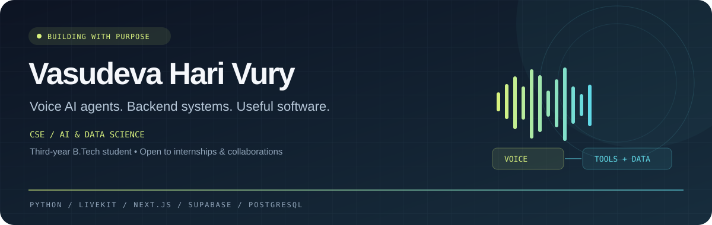
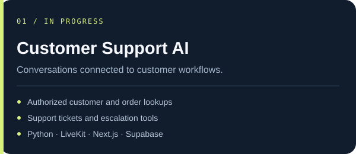
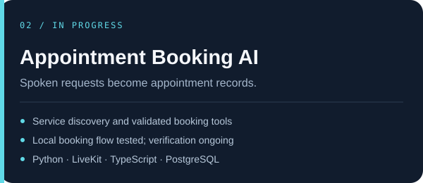

  

  
  
  

<b>I build software that turns conversations into useful actions.</b> 
Python tools · Authenticated APIs · Persistent data · Clear user experiences

---

### 01 / Behind the code

I'm **Vasudeva**, a third-year **B.Tech CSE (AI & Data Science)** student focused on AI agents and backend development.

- **Building:** voice-first customer support and appointment booking assistants.
- **Engineering focus:** validated tool calls, authentication boundaries and database-backed workflows.
- **Growing into:** AI DevOps, reliable deployment and agent orchestration.
- **Open to:** internships, backend projects and AI agent collaborations.

### 02 / Projects in motion

<table>
<tr>
<td width="50%" valign="top">

  
<b>Current stage</b> 
Local web voice prototype. Refining transcription and runtime behavior.
  
<code>Voice request → Customer context → Tools → Spoken response</code>
</td>
<td width="50%" valign="top">

  
<b>Current stage</b> 
Local booking flow tested. Continuing confirmation and end-to-end verification.
  
<code>Service discovery → Validation → Booking → Database record</code>
</td>
</tr>
</table>

Both agents are ongoing local development projects; source and public demos are not yet available. The support prototype uses browser voice sessions.

### 03 / Built & shipped to GitHub

<table>
<tr><td>
<h3>Developer Portfolio</h3>

<b>A complete website implementation, continuously refined.</b>

Cinematic backgrounds, scroll storytelling, responsive project showcases, accessible navigation and reduced-motion support — built with standalone HTML, CSS and JavaScript.

<code>HTML</code> <code>CSS</code> <code>JavaScript</code> <code>Responsive UI</code> <code>Accessibility</code>

<a href="https://github.com/vasudevahari/Portfolio"><b>Explore the source ↗</b></a>

</td></tr>
</table>

### 04 / My engineering toolkit

| Layer | What I work with |
| :--- | :--- |
| **Voice & intelligence** | LiveKit Agents · LiveKit Cloud · LLM tool calling · STT/TTS · Agent prompts |
| **Backend & APIs** | Python services · Next.js Route Handlers · REST · Node.js · Input validation |
| **Data & security** | PostgreSQL · Supabase Auth · Row Level Security · SQL migrations · Data modeling |
| **Interfaces** | Next.js · React · Tailwind CSS · HTML · CSS · Responsive layouts |
| **Languages & tooling** | Python · TypeScript · JavaScript · SQL · C · Java · Git/GitHub · npm/pnpm · pip/uv |
| **Verification** | Python tests · Lint/build checks · Runtime logs · Real voice-session testing |

> **Learning next:** LangGraph · Docker · Deployment workflows  
> Building deeper knowledge through experiments and hands-on projects.

### 05 / From idea to working system

| 01 — Understand | 02 — Architect | 03 — Build | 04 — Verify |
| :--- | :--- | :--- | :--- |
| Map the user workflow and permitted actions. | Define contracts, data models and validation. | Connect interfaces, agent tools and storage. | Test behavior, inspect logs and refine interactions. |

---

### Have a workflow worth automating?

Let's talk about **voice AI, backend systems or your next software project**.

**[vuryhari@gmail.com](mailto:vuryhari@gmail.com)** · **[LinkedIn](https://www.linkedin.com/in/hari-vury-61a363324)** · **[Portfolio](https://github.com/vasudevahari/Portfolio)**

Learning with intention. Building with evidence.

